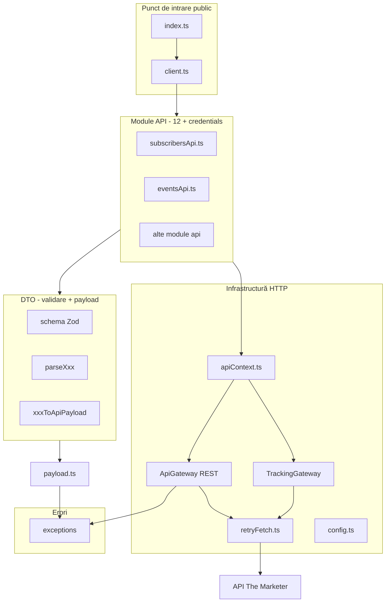

# Arhitectura proiectului `api-client-node`

Ghid de navigare pentru pachetul **@themarketer/api-client** — client TypeScript pentru API-ul The Marketer (port 1:1 din clientul PHP din repo-ul sursă `api-client`).

## Ce este proiectul

| Aspect | Detaliu |
|--------|---------|
| **Runtime** | Node.js >= 18, `fetch` nativ (fără axios/Guzzle) |
| **Validare** | Zod (înlocuiește Symfony Validator din PHP) |
| **Build** | [tsup](tsup.config.ts) → ESM + CJS + `.d.ts` în `dist/` |
| **Teste** | Vitest în [`tests/`](tests/) |

Nu include integrarea Laravel (ServiceProvider, Facade, Mail transport) — acelea rămân doar în pachetul PHP.

---

## Vedere de ansamblu (straturi)



**Regulă simplă:** apelezi **`Client`** → un modul din **`api/`** → validează cu **`dto/`** → trimite prin **`gateways/`**.

---

## Fluxul unui request (exemplu concret)

Pentru `client.subscribers().addSubscriber({ email: 'a@b.com' })`:

1. **[`src/client.ts`](src/client.ts)** — deține instanțe eager ale tuturor modulelor API; `subscribers()` returnează `SubscribersApi` deja creat.
2. **[`src/api/subscribersApi.ts`](src/api/subscribersApi.ts)** — `parseSubscriberValidator(payload)` apoi `context.rest.post('/add_subscriber_sync', body)`.
3. **[`src/dto/subscribers/subscriberValidator.ts`](src/dto/subscribers/subscriberValidator.ts)** — Zod validează; `subscriberValidatorToApiPayload()` construiește JSON-ul (trim pe email, `filterNonEmpty` pe câmpuri opționale).
4. **[`src/common/apiContext.ts`](src/common/apiContext.ts)** — getter `rest` → lazy `ApiGateway`.
5. **[`src/gateways/apiGateway.ts`](src/gateways/apiGateway.ts)** — verifică `customerId` + `restKey`; query auth: `k`, `u`.
6. **[`src/gateways/abstractGateway.ts`](src/gateways/abstractGateway.ts)** — construiește URL (`baseRestUrl` + endpoint), `fetchWithRetry`, parse JSON sau aruncă excepție HTTP.
7. **[`src/common/retryFetch.ts`](src/common/retryFetch.ts)** — retry pe 408/425/429/5xx + erori de rețea, backoff exponențial.

Pentru evenimente tracking (`client.events().sendCustom(...)`), același flux dar gateway-ul este **`tracking`** (`POST /t/r`, auth `k` + `api_key`).

---

## Structura directoarelor

### 1. Intrare publică

| Fișier | Rol |
|--------|-----|
| [`src/index.ts`](src/index.ts) | Barrel export: `Client`, `Config`, excepții, enum-uri, helpers payload, gateways |
| [`src/client.ts`](src/client.ts) | Fațada principală: 12 accesori API + metode credentials (`checkCredentials`, `getCosts`, …) |

**Începe aici** dacă ești consumator al pachetului.

### 2. [`src/common/`](src/common/) — nucleu partajat

| Fișier | Ce face |
|--------|---------|
| [`config.ts`](src/common/config.ts) | Credențiale și URL-uri: `customerId`, `restKey`, `trackingKey`, `restUrl`, `trackingUrl`, `apiVersion`. `baseRestUrl()` → `{restUrl}/api/v1/` |
| [`apiContext.ts`](src/common/apiContext.ts) | Ține `Config` + creează lazy `rest` / `tracking`. Proxy care aruncă `Unknown gateway` (echivalent PHP `__get`) |
| [`abstractApi.ts`](src/common/abstractApi.ts) | Bază pentru module API: `constructor(context: ApiContext)` |
| [`payload.ts`](src/common/payload.ts) | `filterNonEmpty`, `trimStringFields`, `coerceNumericStrings`, `validateAndCreate` → `ValidationException` |
| [`retryFetch.ts`](src/common/retryFetch.ts) | Wrapper `fetch` cu retry; `maxRetryAttempts` = încercări **suplimentare** după prima |

### 3. [`src/gateways/`](src/gateways/) — HTTP

| Fișier | Ce face |
|--------|---------|
| [`abstractGateway.ts`](src/gateways/abstractGateway.ts) | `get/post/put/patch/delete`, headers JSON, `toGatewayQuery()`, mapare 401/404/405, `extractErrorMessage` |
| [`apiGateway.ts`](src/gateways/apiGateway.ts) | REST: base `config.baseRestUrl()`, query `k` + `u` |
| [`trackingGateway.ts`](src/gateways/trackingGateway.ts) | Tracking: base `{trackingUrl}/`, query `k` (tracking key) + `api_key` (rest key) |

**Comportament request:**

- **GET:** payload DTO → **query string** (`toGatewayQuery`)
- **POST:** payload DTO → **body JSON** (sau array JSON pentru bulk subscribers)
- **`json: false`:** returnează `string` brut (ex. `getReferralLink`, `getProductReviews`)

### 4. [`src/api/`](src/api/) — ~70 metode publice

Fiecare fișier = un domeniu API (oglindă `src/Api/` din PHP):

| Modul | Fișier | Gateway | Metode |
|-------|--------|---------|--------|
| Abonați | `subscribersApi.ts` | REST | 13 |
| Comenzi | `ordersApi.ts` | REST | 6 |
| Transactionale | `transactionalsApi.ts` | REST | 4 |
| Produse | `productsApi.ts` | REST | 4 |
| Campanii | `campaignsApi.ts` | REST | 4 |
| Loialitate | `loyaltyApi.ts` | REST | 2 |
| Cupoane | `couponsApi.ts` | REST | 2 |
| Recenzii | `reviewsApi.ts` | REST | 4 |
| Push mobil | `mobilePushApi.ts` | REST | 2 |
| Evenimente | `eventsApi.ts` | REST + tracking | 12 |
| Rapoarte | `reportsApi.ts` | REST | 9 |
| Credențiale | `credentialsClient.ts` | REST | 8 |

**Pattern în fiecare metodă:**

```typescript
const dto = parseSomeDto(input);
return this.context.rest.get('/endpoint', toGatewayQuery(someDtoToApiPayload(dto)));
// sau
return this.context.rest.post('/endpoint', someDtoToApiPayload(dto));
```

**Cum găsești o metodă:** caută endpoint-ul (ex. `/add_subscriber_sync`) în `src/api/`:

```bash
rg "add_subscriber_sync" src/api/
```

### 5. [`src/dto/`](src/dto/) — validare și transformare

Organizat pe domenii: `subscribers/`, `orders/`, `events/`, `campaigns/`, `reports/`, `credentials/`, etc.

**Pattern standard per DTO** (ex. `subscriberValidator.ts`):

```typescript
export const xxxSchema = z.object({ ... });
export type Xxx = z.infer<typeof xxxSchema>;
export function parseXxx(data: unknown): Xxx {
  return validateAndCreate(xxxSchema, data);
}
export function xxxToApiPayload(dto: Xxx): Record<string, unknown> { ... }
```

**Variante importante:**

| Variantă | Exemple |
|----------|---------|
| Default | Copie câmpuri (echivalent `toArray()` PHP) |
| Custom | `filterNonEmpty`, trim, coercie numerică — `saveOrder`, `createProduct`, evenimente cu `source` opțional |
| Imbricate | `createCampaign.ts` — `sender`, `audience`, … |
| Bulk | `addSubscriberBulkToApiPayload` returnează **array** ca body POST |
| Rapoarte | [`dto/reports/reportSchema.ts`](src/dto/reports/reportSchema.ts) + enum-uri din `src/enums/` |

Helpers: [`src/dto/helpers.ts`](src/dto/helpers.ts) (`trackingEventToApiPayload`, `defaultToApiPayload`).

### 6. [`src/enums/`](src/enums/)

Patru seturi de valori `type` pentru rapoarte: `emailReportType`, `smsPushReportType`, `formsReportType`, `audienceReportType` — exportate din `index.ts`.

### 7. [`src/exceptions/`](src/exceptions/)

| Excepție | Cod | Când |
|----------|-----|------|
| `ValidationException` | 400 | Config lipsă, Zod invalid — **înainte** de HTTP |
| `UnauthorizedException` | 401 | Răspuns API |
| `CustomerNotFoundException` | 404 | Răspuns API |
| `MethodNotAllowedException` | 405 | Răspuns API |
| `ApiException` | variabil | Alte erori HTTP |

---

## Export public vs intern

**Public** ([`src/index.ts`](src/index.ts)):

- `Client`, `Config`, `ApiContext`, `AbstractApi`
- `ApiGateway`, `TrackingGateway`
- Excepții, enum-uri, helpers `payload`

**Intern** (folosit prin `Client`, fără re-export):

- Tot din `src/api/` și `src/dto/`
- Pentru teste avansate poți importa direct `parseXxx` / `xxxToApiPayload` din `src/dto/...`

---

## Teste

| Locație | Ce verifică |
|---------|-------------|
| [`tests/unit/`](tests/unit/) | Config, retry, gateways, excepții, payload, DTO smoke |
| [`tests/subscribersApi.test.ts`](tests/subscribersApi.test.ts) | Contract HTTP pentru SubscribersApi |
| [`tests/testCase.ts`](tests/testCase.ts) | `createApiWithMock()`, `lastRequest()` — mock `fetch` injectat în `ApiContext` |

---

## Ordine recomandată de lectură

1. [README.md](README.md) — usage minim
2. [`src/client.ts`](src/client.ts) — ce API-uri expune
3. [`src/common/config.ts`](src/common/config.ts) + [`src/common/apiContext.ts`](src/common/apiContext.ts)
4. [`src/gateways/abstractGateway.ts`](src/gateways/abstractGateway.ts)
5. [`src/api/subscribersApi.ts`](src/api/subscribersApi.ts)
6. [`src/dto/subscribers/subscriberValidator.ts`](src/dto/subscribers/subscriberValidator.ts)
7. (opțional) [`src/dto/campaigns/createCampaign.ts`](src/dto/campaigns/createCampaign.ts) — DTO imbricat
8. [`src/api/eventsApi.ts`](src/api/eventsApi.ts) — REST + tracking
9. [`tests/subscribersApi.test.ts`](tests/subscribersApi.test.ts) — verificare request mock

---

## Mapare PHP → Node

| PHP | Node |
|-----|------|
| `Client.php` | `src/client.ts` |
| `Common\ApiContext.php` | `src/common/apiContext.ts` |
| `Common\Config.php` | `src/common/config.ts` |
| `Gateways\AbstractGateway.php` | `src/gateways/abstractGateway.ts` |
| `Api\SubscribersApi.php` | `src/api/subscribersApi.ts` |
| `DTO\Subscribers\SubscriberValidator.php` | `src/dto/subscribers/subscriberValidator.ts` |
| `AbstractPayload::validateAndCreate` | `parseXxx` + `validateAndCreate` (Zod) |
| `toApiPayload()` | `xxxToApiPayload()` |
| Guzzle + MockHandler | `fetch` injectabil (`fetchFn` în `ClientConfig`) |

---

## Limitări actuale

- Testele Node acoperă mai puțin decât suitea PHP (multe `*ApiTest.php` acolo vs câteva teste aici)
- Publish npm: versiune locală `0.1.0`; release public separat dacă e nevoie
- Paritatea Zod vs Symfony Validator nu e exhaustiv testată pe toate ~58 DTO-urile
